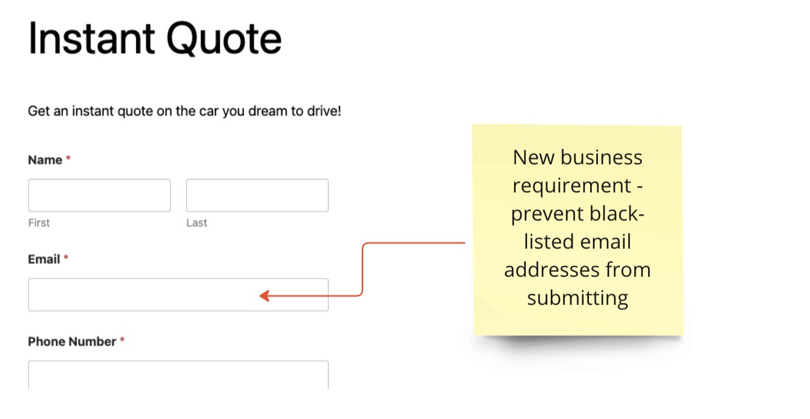
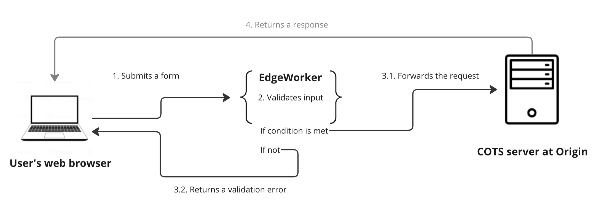
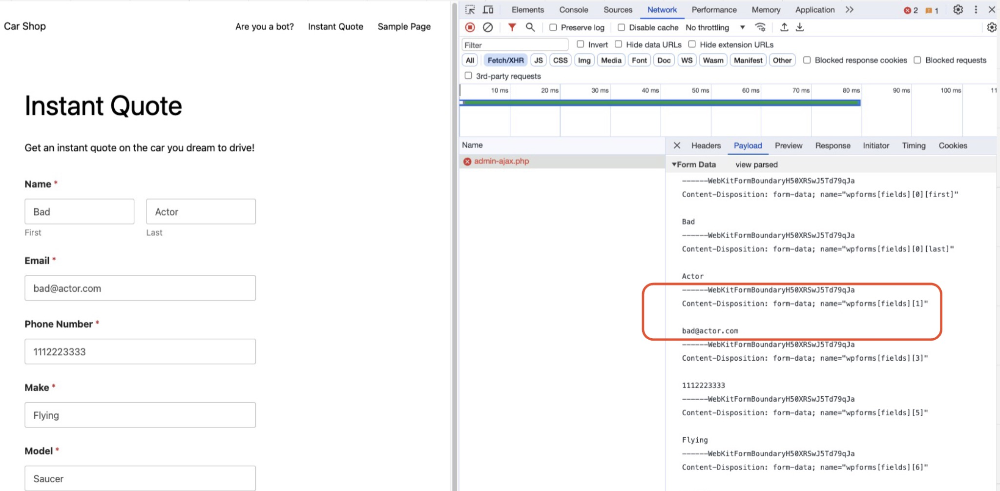
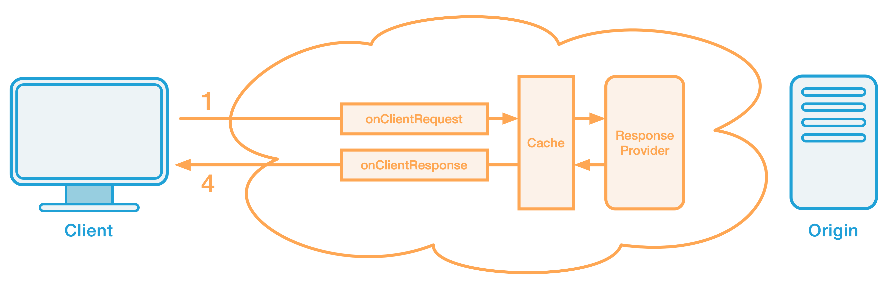

# Interceptive Form Validation using EdgeWorker

## Use case
At times, there is a need to add additional validation logic for a web form in a custom off-the-shelf software product for which source code is not available. One can file a feature request to the vendor, however, it is not unusual to wait for months or even years before getting it implemented. For example, consider a case in which form submission with certain black-listed emails needs to be blocked.



To solve this, Akamai EdgeWorker can be used to intercept requests, validate form input variables, and perform necessary actions.



## Code
In order to build a proper validation logic, the first step is to understand how the form data is transmitted to the backend. One can achieve this by using Network inspect feature that modern web browsers provide, as shown below on Chrome.



Once a pattern for the data to be validated is recognized, a validation logic can be built using regular expression or coding techniques. For the email use case, regular expression matching is used:

```js
const EMAIL_REGEX = /wpforms\[fields\]\[1\][\\\"nr\s]+(?<email>[a-zA-Z0-9]+@[a-zA-Z0-9]+[\.][a-zA-Z]+)/;
```

The following diagram depicts how a request flow from the browser to the origin and functions that can be invoked between them. For more information, refer to the official [doc](https://techdocs.akamai.com/edgeworkers/docs/event-handler-functions).




The function that one need to inject the validation code is `responseProvider`. The validation logic is coded in the `main.js` file.

## Run tests
Most of the code is developed using Test-Driven Development (TDD) methodology, hence the repo contains automated tests that describe expected behaviors of the code. First, install node, then run the following command to execute tests:

```shell
$ node --experimental-vm-modules node_modules/.bin/jest
```

Note that `main.js` is not covedred by any tests.


## Additonal resources
Other use cases and examples can be found in the [github repository](https://github.com/akamai/edgeworkers-examples).

* [EdgeKV Documentation](https://techdocs.akamai.com/edgekv/docs)
* [EdgeWorkers Documentation](https://techdocs.akamai.com/edgeworkers/docs)
* [EdgeWorkers API Reference](https://techdocs.akamai.com/edgeworkers/reference/api)
* [Akamai CLI for EdgeWorkers/EKV](https://developer.akamai.com/legacy/cli/packages/edgeworkers.html)
* [EdgeWorkers Developer Page](https://developer.akamai.com/edgeworkers)